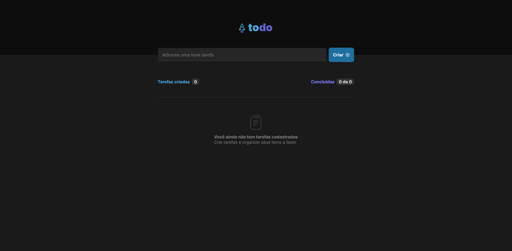
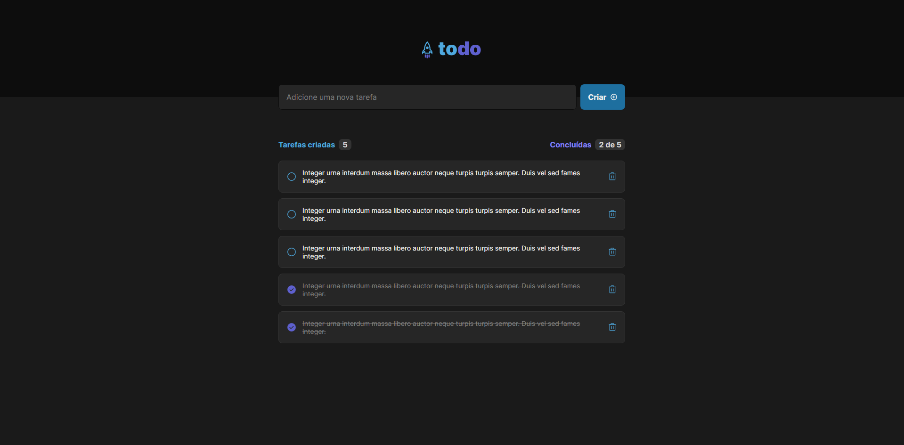

# Todo

### 💻 Sobre o projeto
<p align="center">Este projeto foi um dos desafios do curso ignite da Rocketseat. Trata-se de um to-do-list onde podemos criar, remover e marcar a tarefa como concluída.</p>

### 🎨 Layout

<h1 align="center">
  
  
</h1>

### Funcionalidades

- [x] Adicionar uma nova tarefa
- [x] Marcar e desmarcar uma tarefa como concluída
- [x] Remover uma tarefa da listagem
- [x] Mostrar o progresso de conclusão das tarefas


### 🚀 Como rodar o projeto
```bash
# Clone o repositório
git clone https://github.com/Timoteo0/todo-ignite.git

# Acesse a pasta do projeto
cd todo-ignite

# Instale as dependências
npm install

# Execute a aplicação
npm run dev

# O servidor inciará na porta:3000 - acesse http://localhost:3000
```

### 🛠 Tecnologias

As seguintes ferramentas foram usadas na construção do projeto:

- [Vite](https://vitejs.dev/)
- [Typescript](https://www.typescriptlang.org/)
- [React](https://reactjs.org/)